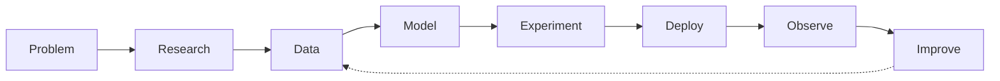

# Hi, I'm Chaitanya Ch 👋

### AI Engineer | Machine Learning • Deep Learning • Generative AI

I'm an **AI Engineer passionate about understanding, building, and deploying intelligent systems**.

My interest in AI goes beyond using high-level APIs. I enjoy understanding how models work internally, experimenting with architectures, and then taking those ideas all the way to **scalable, production-ready AI systems**.

I hold a **Master's in Artificial Intelligence from the Indian Institute of Science (IISc), Bengaluru**, and my work spans **Machine Learning, Deep Learning, Computer Vision, Generative AI, and AI infrastructure**.

---

## 🧠 What I Work On

I enjoy solving problems across the AI stack:

* 🤖 **Generative AI & LLMs** — RAG, agentic systems, embeddings, semantic retrieval, prompt engineering, and multi-agent workflows
* 👁️ **Computer Vision** — object detection, image/video understanding, transformers, and real-time vision systems
* 🧠 **Deep Learning** — transformers, diffusion models, attention mechanisms, representation learning, and model architectures
* 📊 **Machine Learning** — feature engineering, classification, ensemble learning, model evaluation, and predictive systems
* ⚡ **AI Inference** — GPU-accelerated inference, low-latency pipelines, distributed inference, and edge AI
* ☁️ **Production AI** — microservices, event-driven architectures, APIs, containers, cloud infrastructure, observability, and scalable ML pipelines

---

## 🔬 How I Like to Build

I enjoy working across the complete lifecycle of an AI system:

For me, building AI isn't just about achieving a good model metric.

I'm interested in questions like:

> **How does the model actually work?**
> **How do we make it reliable?**
> **How do we make inference fast and scalable?**
> **How does it behave with real-world data?**
> **How do we turn a prototype into a system people can actually use?**

That curiosity has given me experience solving AI problems involving **large-scale data, real-time video, GPU inference, retrieval systems, LLM workflows, distributed AI services, edge computing, and production ML pipelines**.

---

## 🛠️ Tech I Work With

**Languages**

`Python` `SQL`

**AI / ML**

`PyTorch` `scikit-learn` `Deep Learning` `Computer Vision` `Transformers` `Transfer Learning`

**Generative AI**

`LLMs` `RAG` `LangChain` `LangGraph` `Agentic AI` `Embeddings` `Prompt Engineering`

**AI Engineering**

`FastAPI` `REST APIs` `Docker` `GPU Inference` `Edge AI` `Microservices`

**Cloud**

`Oracle Cloud Infrastructure (OCI)` `OCI Generative AI` `Object Storage` `OCI Queue` `Oracle Database 23ai`

---

## 📚 Always Learning

AI is moving incredibly fast, and that's exactly what keeps me interested.

I spend my time exploring new architectures, reading papers, understanding how models work from first principles, experimenting with new ideas, and finding ways to translate research into **practical AI systems**.

I'm particularly interested in the intersection of:

**Deep Learning × Generative AI × Computer Vision × Agentic Systems × AI Infrastructure**

---

### 🤝 Let's Connect

I'm always interested in discussing **AI, ML, deep learning, interesting research, system design, and challenging engineering problems**.

If you're building something interesting in AI, I'd love to hear about it. You can always drop a mail to chaitanyachennam@gmail.com
