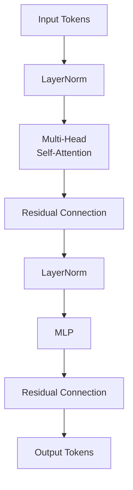

# Vision Transformer (ViT) from Scratch in PyTorch 👁️

A from-scratch implementation of a **Vision Transformer (ViT)** in PyTorch for image classification on the **CIFAR-10** dataset.

The project explores how the Transformer architecture—originally designed for sequence modeling—can be applied directly to images by representing an image as a **sequence of patches**.

Rather than using a pretrained ViT implementation, the core architecture is constructed using PyTorch components to understand the mechanics behind **patch embeddings, positional embeddings, multi-head self-attention, transformer blocks, and token-based image classification**.

---

## 🧠 Architecture

```mermaid id="m4h1ca"
flowchart LR
    A["CIFAR-10 Image<br/>32 × 32 × 3"] --> B["Patch Extraction<br/>4 × 4"]
    B --> C["64 Image Patches"]
    C --> D["Linear Projection<br/>128-D Embeddings"]
    D --> E["+ Positional Embeddings"]
    E --> F["+ Learnable Output Token"]
    F --> G["Transformer Encoder<br/>× 8"]
    G --> H["Output Token"]
    H --> I["Linear Classifier"]
    I --> J["10 CIFAR-10 Classes"]
```



---

## 🔍 How It Works

### 1. Images Become Sequences

Unlike CNNs, which process images using convolutional kernels, a Vision Transformer divides an image into **non-overlapping patches**.

For an image of size:

```text
32 × 32 × 3
```

with:

```text
Patch size = 4 × 4
```

the number of patches is:

```text
(32 / 4) × (32 / 4) = 64 patches
```

Each patch contains:

```text
4 × 4 × 3 = 48 values
```

The implementation uses `torch.nn.Unfold` to efficiently extract these non-overlapping patches.

```python
unfold = torch.nn.Unfold(
    kernel_size=patch_size,
    stride=patch_size
)
```

Setting the stride equal to the patch size ensures that patches do not overlap.

---

## 🧩 Patch Embeddings

Each flattened image patch is projected into the Transformer's hidden dimension using a learnable linear layer:

```text
Image
   ↓
64 × 48 patches
   ↓
Linear Projection
   ↓
64 × 128 embeddings
```

Learnable **positional embeddings** are then added so that the Transformer can retain information about where each patch originated in the image.

A learnable **output token** is prepended to the sequence and later used for image classification.

---

## ⚡ Transformer Encoder

The core of the model consists of **8 Transformer blocks**, each containing:



Each block uses:

* Layer Normalization
* Multi-Head Self-Attention
* Residual connections
* Feed-forward MLP
* ELU activation

The model uses **8 attention heads**, allowing different heads to learn relationships between different regions of an image.

---

## 🔄 End-to-End Pipeline


Self-attention allows every image patch to interact with every other patch, enabling the model to learn **global relationships across the image**.

---

## 🏗️ Model Configuration

| Parameter          |    Value |
| ------------------ | -------: |
| Dataset            | CIFAR-10 |
| Image Size         |  32 × 32 |
| Channels           |        3 |
| Patch Size         |    4 × 4 |
| Number of Patches  |       64 |
| Hidden Dimension   |      128 |
| Transformer Layers |        8 |
| Attention Heads    |        8 |
| Output Classes     |       10 |
| Batch Size         |      128 |
| Epochs             |       50 |
| Learning Rate      |     1e-4 |

---

## 📊 Training

The model is trained from scratch using:

* **Adam** optimizer
* **Cross-Entropy Loss**
* **Cosine Annealing Learning Rate Scheduler**
* CIFAR-10 **AutoAugment**
* Train/validation/test evaluation

```python
optimizer = optim.Adam(
    model.parameters(),
    lr=1e-4
)

lr_scheduler = optim.lr_scheduler.CosineAnnealingLR(
    optimizer,
    T_max=50
)

loss_fn = nn.CrossEntropyLoss()
```

The dataset is split into:

```text
CIFAR-10
│
├── Training
│
├── Validation
│
└── Test
```

Training images are augmented using CIFAR-10's `AutoAugment` policy before normalization.

---

## 🧪 Evaluation

Accuracy is evaluated after each epoch on both the training and validation sets.

The notebook also tracks:

* Training loss
* Training accuracy
* Validation accuracy
* Final test accuracy
* Predictions on sample test images

This makes it possible to inspect both optimization behavior and generalization during training.

---

## 🚀 Running the Project

### Requirements

```bash
pip install torch torchvision numpy matplotlib tqdm
```

Run the notebook:

```text
ViT.ipynb
```

The CIFAR-10 dataset is automatically downloaded through `torchvision.datasets.CIFAR10`.

CUDA is automatically used when a compatible GPU is available:

```python
device = torch.device(
    "cuda" if torch.cuda.is_available() else "cpu"
)
```

---

## 📁 Project Structure

```text
ViT.ipynb
│
├── Data Loading & Augmentation
│
├── Image Patch Extraction
│
├── TransformerBlock
│   ├── LayerNorm
│   ├── Multi-Head Self-Attention
│   ├── Residual Connection
│   └── MLP
│
├── Vision Transformer
│   ├── Patch Projection
│   ├── Positional Embeddings
│   ├── Learnable Output Token
│   ├── Transformer Encoder
│   └── Classification Head
│
├── Training
│   ├── Adam Optimizer
│   ├── Cross-Entropy Loss
│   └── Cosine LR Scheduler
│
└── Evaluation & Visualization
```

---

## 💡 Why This Project?

Modern libraries make it easy to load a pretrained Vision Transformer in a few lines of code.

The goal of this implementation is different: **understand how Vision Transformers work internally by building the architecture from its fundamental components.**

It explores the complete transformation:

```text
Pixels
   ↓
Image Patches
   ↓
Patch Embeddings
   ↓
Positional Information
   ↓
Self-Attention
   ↓
Transformer Representations
   ↓
Image Classification
```

Building the architecture from scratch provides a deeper understanding of how **Transformers can model visual information without relying on traditional convolutional architectures**.

---

## 🛠️ Tech Stack

**Python · PyTorch · Torchvision · Vision Transformers · Multi-Head Attention · CIFAR-10 · NumPy · Matplotlib**
