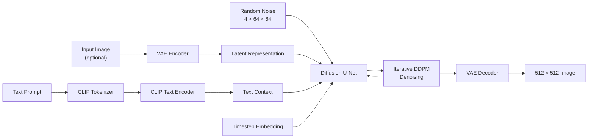
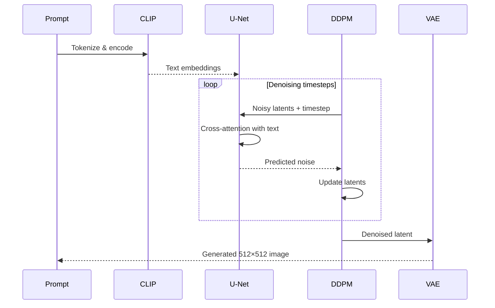

# Stable Diffusion from Scratch in PyTorch

A from-scratch implementation of the **Stable Diffusion inference pipeline** in PyTorch, covering the core architecture behind latent diffusion rather than relying on a pre-built diffusion pipeline.

The project implements the major building blocks of Stable Diffusion—including **CLIP text conditioning, VAE latent encoding/decoding, U-Net denoising, self/cross-attention, DDPM sampling, and classifier-free guidance (CFG)**—and supports both **text-to-image** and **image-to-image** generation.

## Architecture



## What's Implemented

* **CLIP text encoder** for prompt conditioning
* Multi-head **self-attention** and **cross-attention**
* **Variational Autoencoder (VAE)** encoder and decoder
* Stable Diffusion **U-Net** with residual and attention blocks
* Sinusoidal **timestep embeddings**
* **DDPM sampler** and iterative latent denoising
* **Classifier-Free Guidance (CFG)** with configurable guidance scale
* **Text-to-image** generation from Gaussian noise
* **Image-to-image** generation with configurable denoising strength
* Seeded generation for reproducible inference
* Conversion/loading of standard Stable Diffusion checkpoint weights
* CPU/GPU model offloading support for memory-efficient inference

## Inference Pipeline

The model performs generation entirely in **latent space**:



For classifier-free guidance, conditional and unconditional prompt embeddings are evaluated together and combined as:

```text
ε = ε_uncond + guidance_scale × (ε_cond − ε_uncond)
```

This strengthens the influence of the text prompt during generation.

## Model Components

| Component          | Purpose                                               |
| ------------------ | ----------------------------------------------------- |
| `CLIP`             | Converts tokenized prompts into contextual embeddings |
| `SelfAttention`    | Models relationships within a sequence                |
| `CrossAttention`   | Conditions image generation on text embeddings        |
| `VAE_Encoder`      | Compresses input images into latent space             |
| `Diffusion / UNET` | Predicts noise at each diffusion timestep             |
| `DDPMSampler`      | Controls forward/reverse diffusion scheduling         |
| `VAE_Decoder`      | Converts denoised latents back into RGB images        |

## Example

```python
prompt = "A cat in a Superman costume"

output_image = generate(
    prompt=prompt,
    uncond_prompt="",
    do_cfg=True,
    cfg_scale=8,
    sampler_name="ddpm",
    n_inference_steps=50,
    seed=42,
    models=models,
    device=device,
    tokenizer=tokenizer
)

Image.fromarray(output_image)
```

### Image-to-Image

Provide an input image and control how strongly the generated result deviates from it:

```python
input_image = Image.open("input.jpg")

output_image = generate(
    prompt="A cinematic portrait",
    input_image=input_image,
    strength=0.8,
    cfg_scale=7.5,
    n_inference_steps=50,
    models=models,
    device=device,
    tokenizer=tokenizer
)
```

Higher `strength` values introduce more noise into the encoded image, allowing the generated result to deviate further from the original.

## Requirements

```bash
pip install torch torchvision transformers lightning pillow numpy tqdm
```

A compatible **Stable Diffusion checkpoint** is required to load the pretrained model weights.

For practical inference, a CUDA-capable GPU is recommended.

## Project Structure

```text
Stable_Diffusion.ipynb
│
├── Attention
│   ├── SelfAttention
│   └── CrossAttention
│
├── CLIP
│   ├── CLIPEmbedding
│   ├── CLIPLayer
│   └── CLIP
│
├── VAE
│   ├── VAE_Encoder
│   ├── VAE_Decoder
│   ├── VAE_ResidualBlock
│   └── VAE_AttentionBlock
│
├── Diffusion
│   ├── TimeEmbedding
│   ├── UNET
│   ├── UNET_ResidualBlock
│   ├── UNET_AttentionBlock
│   └── Diffusion
│
├── Sampling
│   └── DDPMSampler
│
└── Pipeline
    ├── Checkpoint conversion
    ├── Text-to-image
    └── Image-to-image
```

## Why This Project?

High-level diffusion libraries can reduce Stable Diffusion inference to only a few lines of code. This implementation instead exposes the internals of the model to demonstrate how the complete pipeline works:

**prompt encoding → latent initialization → conditioned U-Net denoising → DDPM sampling → VAE decoding**

The goal is to provide a practical implementation for understanding the architecture and inference mechanics behind **latent diffusion models and Stable Diffusion**.

## Tech Stack

**Python · PyTorch · Transformers · CLIP · Stable Diffusion · DDPM · CUDA · NumPy · PIL**
